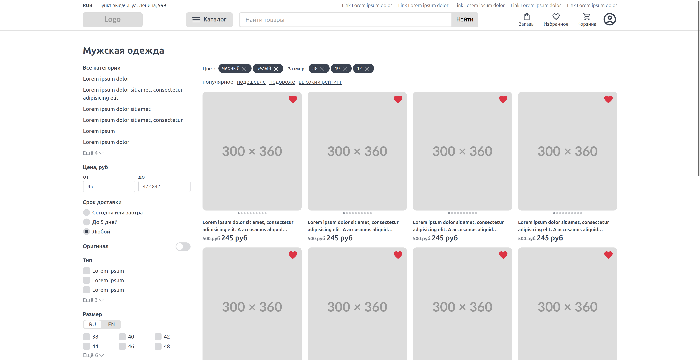
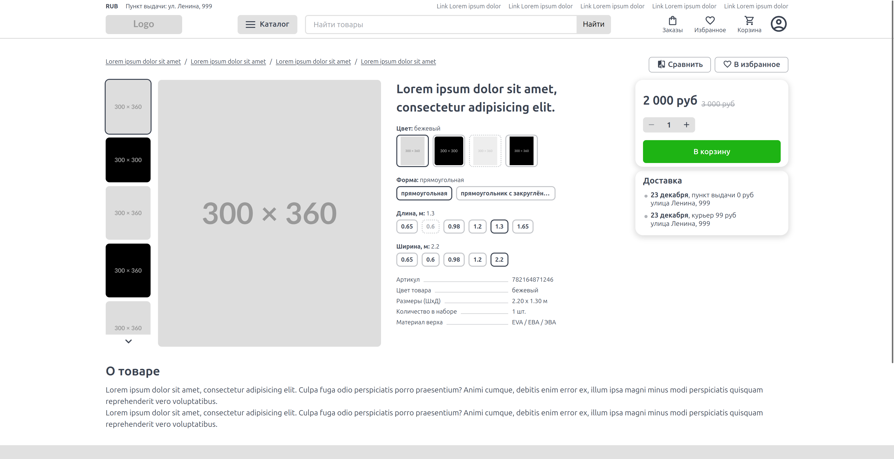

# Shop front v1 template

Only HTML+CSS+VanillaJS.

Шаблон разделён на компоненты. Наименование css классов выполнено в стилистике БЭМ.
Наименование css классов компонентов формируется по шаблону `[префикс][название компонента]`, например `shop-btn`
где `shop-` - префикс, а `btn` - название компонента. Если компонентов одного вида много, например: много `checkbox`.
То в таком случае добавляются латинские буквы от `a` до `z` согласно шаблону `[a-z]-[название компонента]`,
например: `a-checkbox`, `b-checkbox`, `c-checkbox`. А классы в таком случае выглядят
так: `shop-a-checkbox`, `shop-b-checkbox`, `shop-c-checkbox`.

Список готовых страниц шаблона:
1) [Главная](public/index.html)
2) [Вход](public/login.html)
3) [Регистрация](public/register.html)
4) [Сбросить пароль](public/forgot-password.html)
5) [Подтверждение сброса пароля](public/forgot-password-confirm.html)
6) [Корзина](public/cart.html)
7) [Каталог](public/catalog.html)
8) [Сравнение товаров](public/comparison.html)
9) [Пустая корзина](public/empty-cart.html)
10) [Пустая страница избранного](public/empty-favorite.html)
11) [Пустая страница заказов](public/empty-orders.html)
12) [Страница избранного](public/favorite.html)
13) [Заказы](public/orders.html)
14) [Баллы и купоны](public/points.html)
15) [Страница товара](public/product.html)
16) [Настройки пользователя](public/settings.html)
17) [Страница поддержки](public/support.html)

Icons for menu:
https://marella.me/material-design-icons/demo/font/#round

Images:

